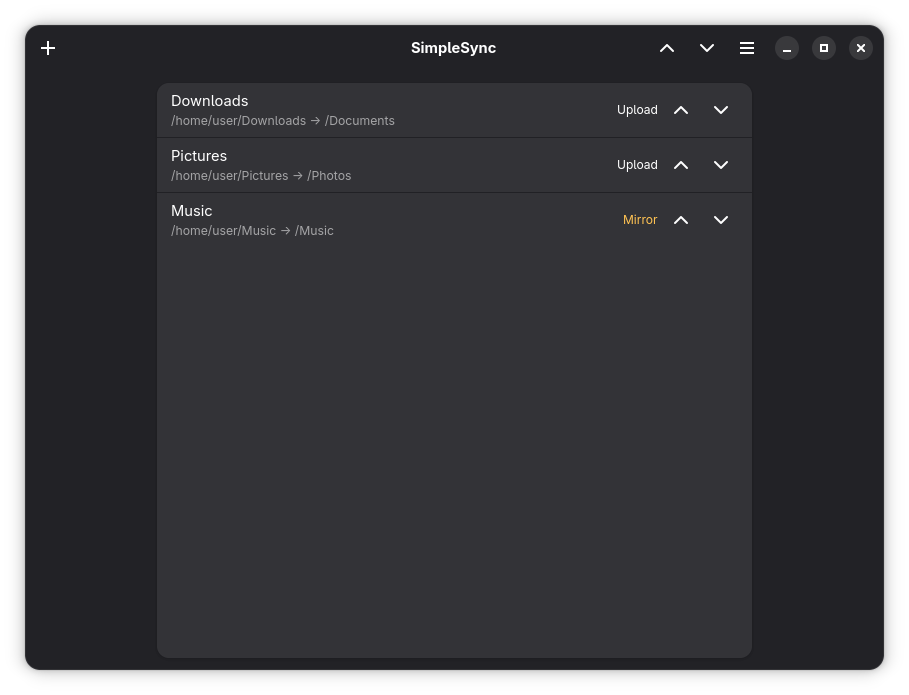
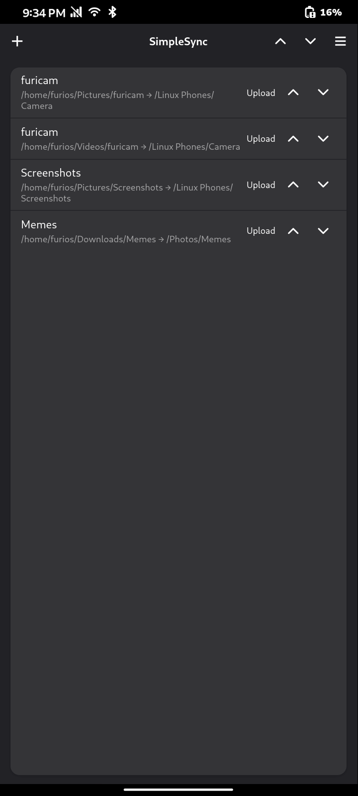
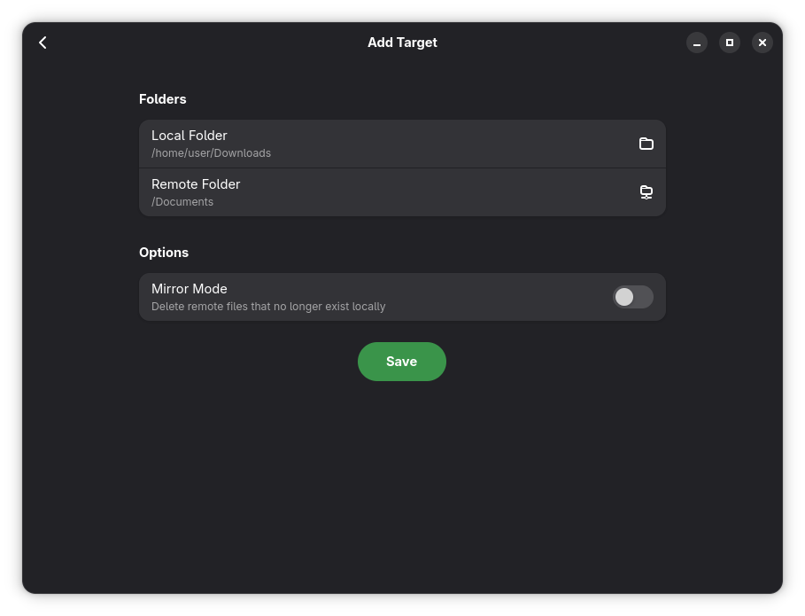
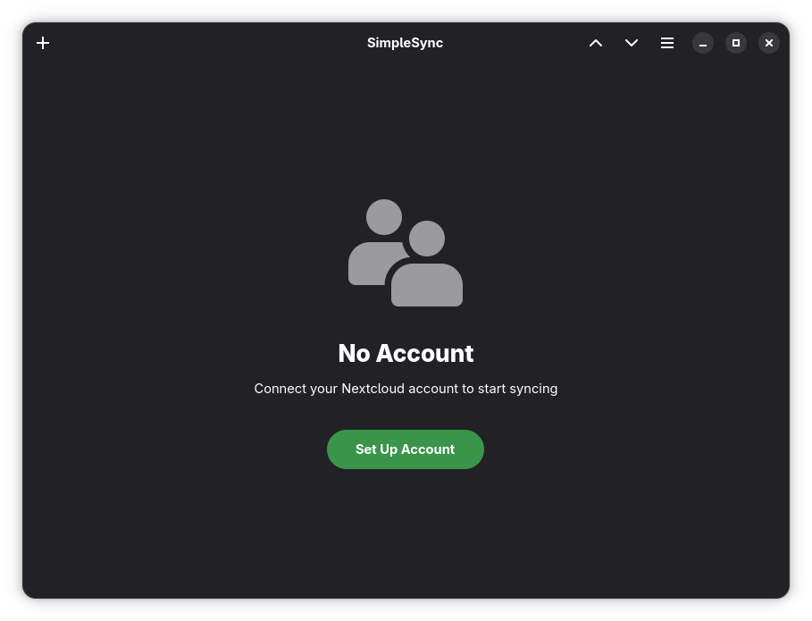
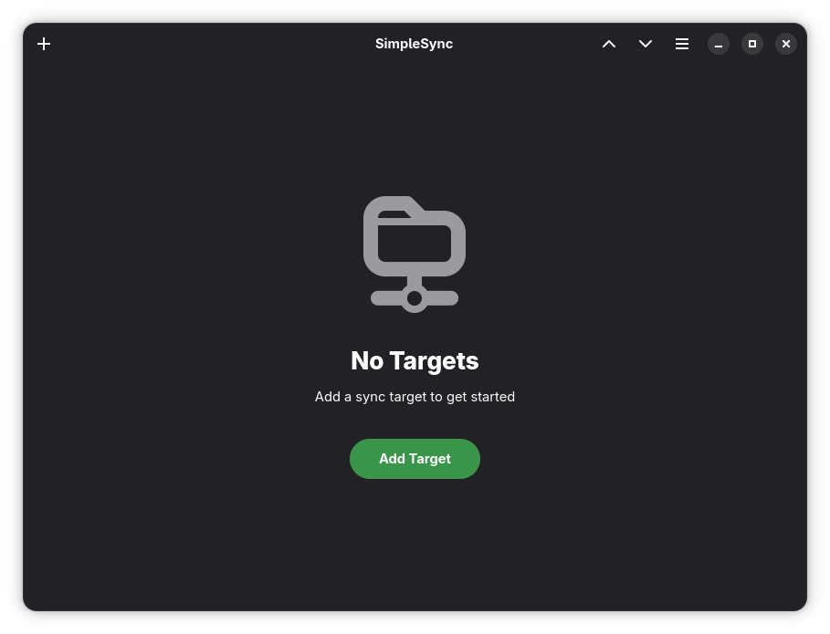

# SimpleSync

A (vibe coded) simple file sync tool for Nextcloud and WebDAV servers, built with GTK4 and Libadwaita in Rust.

My motivation for this was the fact that UBSync is specifically made for Ubuntu Touch and the Nextcloud Desktop Client is not really made for using it on a mobile device. It also has no option to just push local changes without syncing all the remote content (at least that I know of). This is especially annoying if you want to upload e.g. pictures from your device to a folder that already contains a lot of files, because it will try to download everything from the server, which is not desirable behaviour in my opinion. I wanted something similar to the auto upload feature of the Nextcloud Android/iOS app without having to mess around with rsync or something similar. Therefore I decided to create this simple app.

## Features

- Push local folders to Nextcloud/WebDAV with incremental uploads
- Pull remote content down to a local folder
- Optional mirror mode (also deletes remote files that no longer exist locally)
- Chunked uploads with resume for large files on Nextcloud
- Log in with the Nextcloud Login Flow v2 (works with 2FA)
- Configure as many targets as you want and push/pull them all at once
- Mobile-friendly: works on Linux phones as well as on the desktop

## Screenshots

<div style="display: flex; flex-wrap: wrap; gap: 20px;">
  
  
  
  
  
</div>

## Credits

Inspired by [UBsync](https://github.com/belohoub/UBsync), an Ubuntu Touch app by belohoub.

## Building

SimpleSync is built with Meson and Cargo. The easiest way to build is via GNOME Builder IDE or flatpak-builder.

Example using flatpak-builder as a flatpak:
-  Install flatpak-builder
```
flatpak install org.flatpak.Builder
```

-  Compile the project into a local repo
```
flatpak run org.flatpak.Builder --repo=repo --force-clean --user build io.github.nico359.simplesync.json
```

-  Then create a bundle which you can install
```
flatpak build-bundle repo simplesync.flatpak io.github.nico359.simplesync
```

## Previous Version

The original Python implementation is preserved on the `python-legacy` branch.

## License

GPL-3.0-or-later

## AI Disclosure

This application was built with the assistance of AI (GitHub Copilot CLI with Claude, and OpenCode with DeepSeek).
